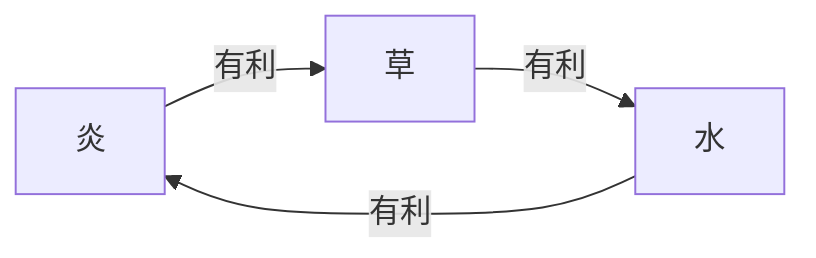
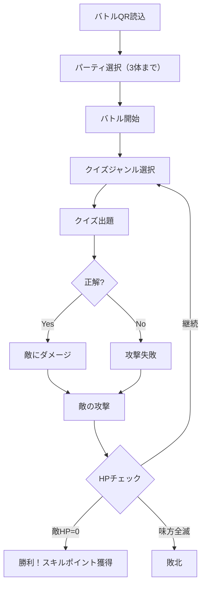

# グッズン - 概要設計書

## 1. プロジェクト概要

### 1.1 コンセプト
**「学校に来るのが楽しくなるアプリ」**

学生が学校に来たくなる仕組みをゲームアプリで提供する。文房具を擬人化したキャラクター「グッズン」を育成・対戦させることで、登校へのモチベーションを向上させる。

### 1.2 ターゲットユーザー
- 小学校高学年〜高校生
- 学校に通う学生

### 1.3 主要な価値提案
| 価値 | 説明 |
|------|------|
| 早起き促進 | 朝早く来るほど多くのコインを獲得できる仕組み |
| 学習意欲向上 | クイズバトル形式で知識を競い合える |
| コレクション欲求 | 様々なグッズンを集める楽しさ |
| 成長実感 | キャラクターの育成を通じた達成感 |

---

## 2. システム概要

### 2.1 グッズンとは
文房具を擬人化したキャラクターの総称。ユーザーは「トレーナー」となり、グッズンを育成・強化してバトルに挑む。

### 2.2 属性システム

| 攻撃側 | 防御側 | 結果 |
|--------|--------|------|
| 炎 | 草 | 炎側有利（ダメージ増加） |
| 草 | 水 | 草側有利（ダメージ増加） |
| 水 | 炎 | 水側有利（ダメージ増加） |
| 同属性 | 同属性 | 等倍ダメージ |

### 2.3 初期グッズン
| 名前 | モチーフ | 属性 |
|------|----------|------|
| エンピツン | 鉛筆 | 炎 |
| ケシゴムン | 消しゴム | 水 |
| メモパッドン | メモ帳 | 草 |

---

## 3. 主要機能一覧

### 3.1 ユーザー管理
| 機能 | 説明 |
|------|------|
| 会員登録 | メールアドレス/パスワードで登録 |
| ログイン | 認証後、5日間自動ログイン維持 |
| 初期グッズン選択 | 初回ログイン時に3体から1体を選択 |

### 3.2 QRコード機能
| 機能 | 説明 |
|------|------|
| 出席QR読込 | 教室のQRで出席登録＋コイン獲得 |
| バトルQR読込 | バトル開始＋地形設定 |

#### コイン獲得量（時間帯別）
| 時間帯 | コイン数 |
|--------|----------|
| 〜7:30 | 100コイン |
| 7:31〜8:00 | 70コイン |
| 8:01〜8:30 | 50コイン |
| 8:31〜 | 30コイン |

### 3.3 バトル機能
| 機能 | 説明 |
|------|------|
| パーティ編成 | 手持ちから3体まで選択 |
| クイズ出題 | 属性別ジャンルから選択して回答 |
| ダメージ計算 | 属性相性・地形・強化グッズを考慮 |
| 報酬獲得 | 勝利時にスキルポイント獲得 |

### 3.4 育成・収集機能
| 機能 | 説明 |
|------|------|
| ガチャ | コインでランダムにグッズン獲得 |
| ステータス強化 | スキルポイントで能力値UP |
| コレクション | 所持グッズン一覧表示 |

### 3.5 ショップ機能
| 機能 | 説明 |
|------|------|
| 強化グッズ購入 | 攻撃力UP・防御力UPアイテム等 |
| ガチャチケット | ガチャ用チケット購入 |

---

## 4. グッズンステータス

| ステータス | 説明 | 初期値範囲 |
|------------|------|------------|
| HP | 体力。0で戦闘不能 | 50〜100 |
| Attack | 攻撃力。与ダメージ計算に使用 | 10〜30 |
| Defence | 守備力。被ダメージ計算に使用 | 10〜30 |
| Level | レベル。クイズ難易度に影響 | 1〜100 |

---

## 5. バトルフロー

---

## 6. ユースケース

### UC-01: 朝の出席登録
1. 学生が学校に到着
2. 教室のQRコードをスキャン
3. 出席登録完了＋時間帯に応じたコイン獲得
4. ホーム画面でコイン残高を確認

### UC-02: バトル実行
1. バトルQRコードをスキャン
2. パーティ（1〜3体）を編成
3. クイズジャンル（属性）を選択
4. クイズに回答
5. 正解でダメージ、不正解で失敗
6. 敵の攻撃を受ける
7. 勝敗が決まるまで繰り返し
8. 勝利時はスキルポイント獲得

### UC-03: ガチャ実行
1. ショップ画面からガチャを選択
2. コインを消費してガチャ実行
3. ランダムでグッズン1体獲得
4. コレクションに追加

---

## 7. 非機能要件

| 項目 | 要件 |
|------|------|
| 可用性 | 99.5%以上の稼働率 |
| 応答時間 | API応答は2秒以内 |
| セキュリティ | パスワードはハッシュ化保存 |
| スケーラビリティ | 同時接続1000ユーザー対応 |
| オフライン対応 | コレクション閲覧は可能 |
