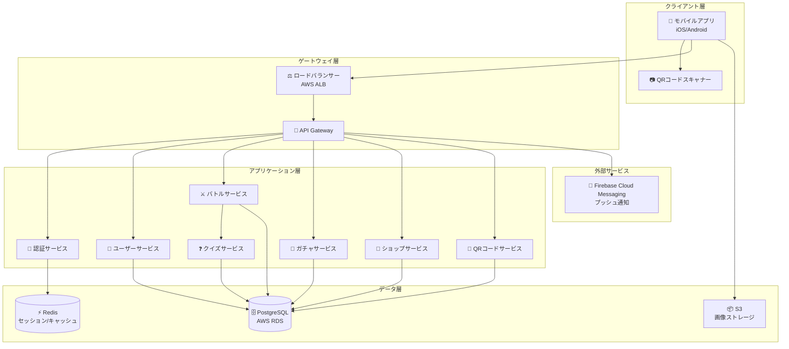
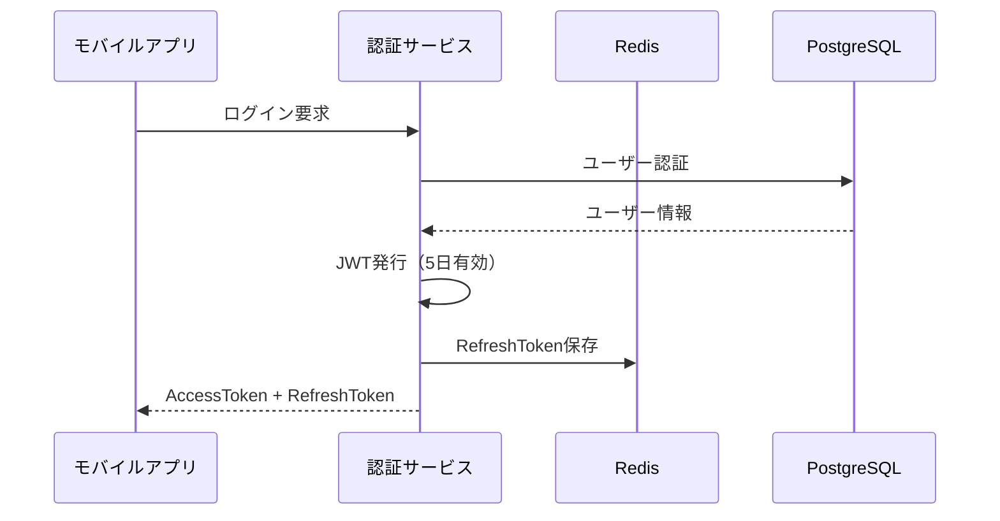
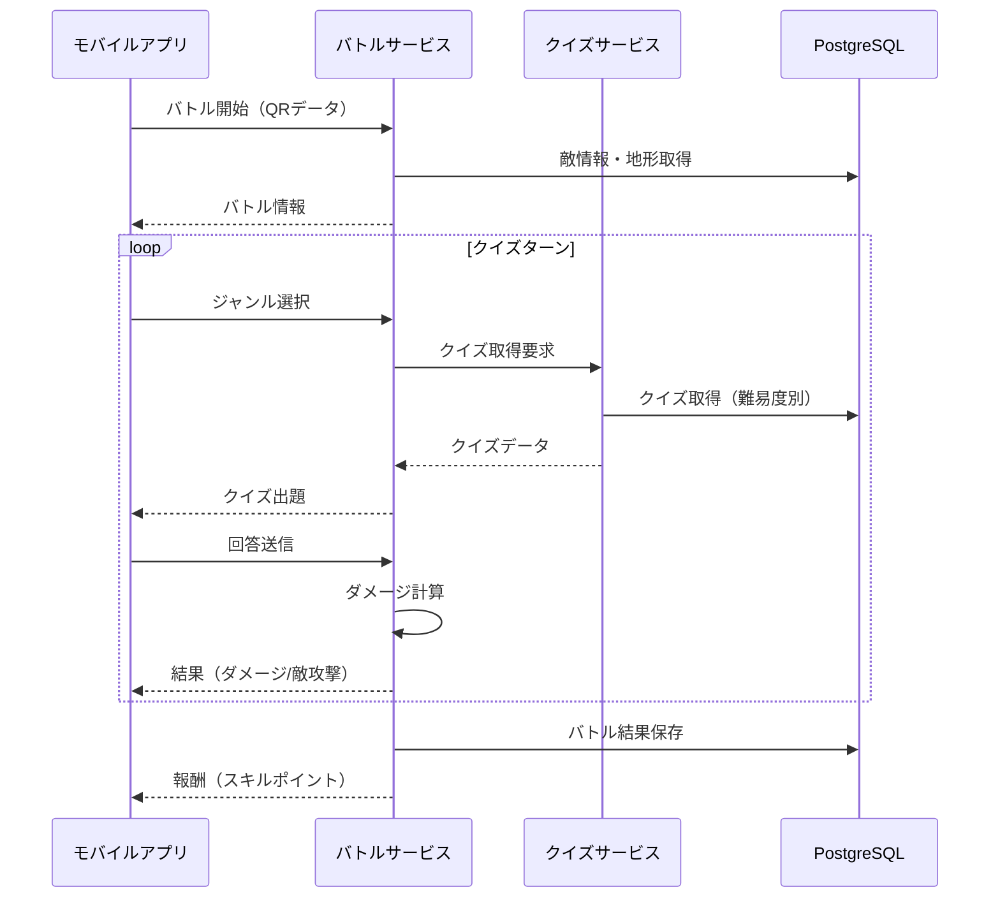
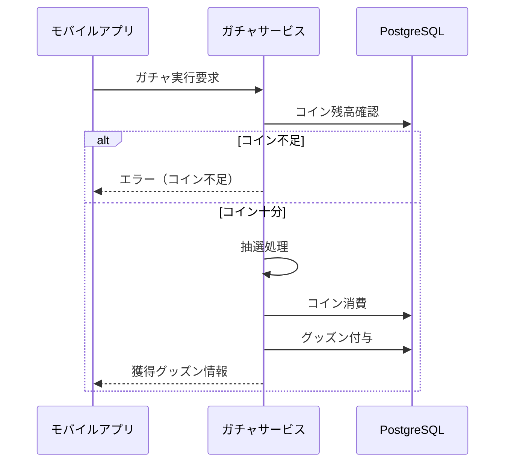
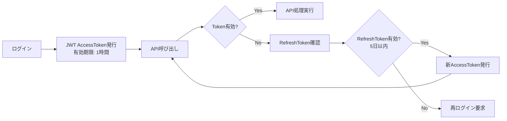
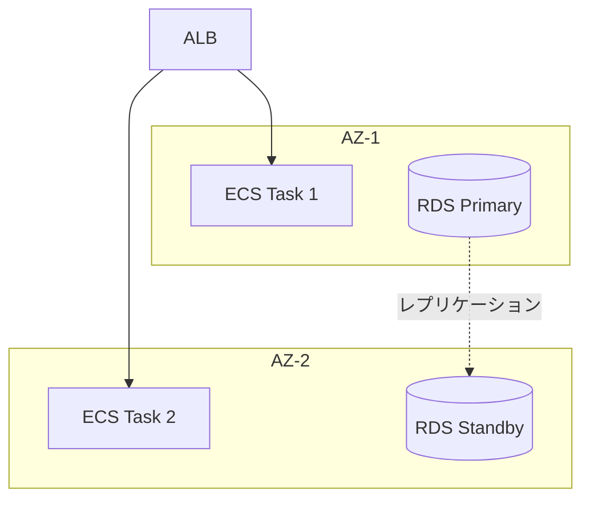

# グッズン - システム構成図

## 1. システムアーキテクチャ全体図



---

## 2. 技術スタック

### 2.1 フロントエンド（モバイルアプリ）

| カテゴリ | 技術 | 理由 |
|----------|------|------|
| フレームワーク | Flutter | iOS/Android同時開発、高パフォーマンス |
| 状態管理 | Riverpod | シンプルで型安全 |
| ローカルDB | SQLite | オフライン対応 |
| QRスキャン | mobile_scanner | 高速・軽量 |

### 2.2 バックエンド

| カテゴリ | 技術 | 理由 |
|----------|------|------|
| 言語 | TypeScript | 型安全、フロントと共通 |
| フレームワーク | NestJS | エンタープライズ向け、DI対応 |
| ORM | Prisma | 型安全、マイグレーション管理 |
| 認証 | JWT + Refresh Token | ステートレス、5日間キャッシュ対応 |

### 2.3 インフラストラクチャ

| カテゴリ | 技術 | 理由 |
|----------|------|------|
| クラウド | AWS | 実績・信頼性 |
| コンテナ | ECS Fargate | サーバーレス運用 |
| DB | RDS PostgreSQL | 信頼性・ACID準拠 |
| キャッシュ | ElastiCache Redis | 高速セッション管理 |
| CDN | CloudFront | 画像配信高速化 |
| ストレージ | S3 | グッズン画像保存 |

---

## 3. サービス構成詳細

### 3.1 認証サービス (Auth Service)


### 3.2 バトルサービス (Battle Service)


### 3.3 ガチャサービス (Gacha Service)


---

## 4. QRコード設計

### 4.1 出席用QRコード
```json
{
  "type": "attendance",
  "school_id": "SCH001",
  "classroom_id": "CLS101",
  "valid_date": "2026-02-06"
}
```

### 4.2 バトル用QRコード
```json
{
  "type": "battle",
  "battle_id": "BTL001",
  "terrain": "fire",
  "enemy_id": "ENM001",
  "difficulty": 3
}
```

---

## 5. セキュリティ設計

### 5.1 認証・認可


### 5.2 セキュリティ対策

| 対策 | 説明 |
|------|------|
| HTTPS強制 | 全通信をTLS1.3で暗号化 |
| パスワードハッシュ | bcryptでソルト付きハッシュ |
| レート制限 | API呼び出し回数制限 |
| QR検証 | 署名付きQRコードで改ざん防止 |
| SQLインジェクション | ORMによるパラメータバインド |

---

## 6. 可用性・スケーラビリティ

### 6.1 冗長構成


### 6.2 オートスケーリング

| メトリクス | 閾値 | アクション |
|------------|------|------------|
| CPU使用率 | 70%超過 | タスク追加 |
| CPU使用率 | 30%未満 | タスク削減 |
| 同時接続数 | 500超過/タスク | タスク追加 |

---

## 7. 監視・ログ

| サービス | 用途 |
|----------|------|
| CloudWatch | メトリクス監視・アラート |
| CloudWatch Logs | アプリケーションログ |
| X-Ray | 分散トレーシング |
| SNS | アラート通知 |
