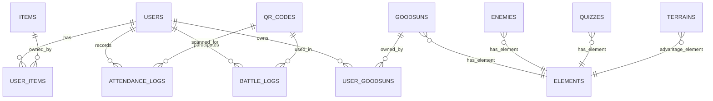

# グッズン - データベース設計書

## 1. ER図



---

## 2. 主要テーブル定義

### USERS（ユーザー）
| カラム名 | 型 | NULL | 説明 |
|----------|-----|------|------|
| id | UUID | NO | PK |
| email | VARCHAR(255) | NO | UK メールアドレス |
| password_hash | VARCHAR(255) | NO | ハッシュ化PW |
| username | VARCHAR(50) | NO | ユーザー名 |
| coins | INT | NO | 所持コイン |
| created_at | TIMESTAMP | NO | 登録日時 |
| last_login_at | TIMESTAMP | YES | 最終ログイン |

### GOODSUNS（グッズンマスター）
| カラム名 | 型 | NULL | 説明 |
|----------|-----|------|------|
| id | UUID | NO | PK |
| name | VARCHAR(50) | NO | グッズン名 |
| element_id | UUID | NO | FK属性 |
| base_hp | INT | NO | 基礎HP |
| base_attack | INT | NO | 基礎攻撃力 |
| base_defence | INT | NO | 基礎守備力 |
| rarity | INT | NO | レアリティ(1-5) |
| image_url | VARCHAR(500) | YES | 画像URL |

**初期データ:**
| name | element | HP | ATK | DEF | rarity |
|------|---------|-----|-----|-----|--------|
| エンピツン | 炎 | 80 | 25 | 15 | 1 |
| ケシゴムン | 水 | 100 | 15 | 25 | 1 |
| メモパッドン | 草 | 90 | 20 | 20 | 1 |

### USER_GOODSUNS（所持グッズン）
| カラム名 | 型 | NULL | 説明 |
|----------|-----|------|------|
| id | UUID | NO | PK |
| user_id | UUID | NO | FK→USERS |
| goodsun_id | UUID | NO | FK→GOODSUNS |
| level | INT | NO | 現在レベル |
| current_hp/attack/defence | INT | NO | 現在ステータス |
| experience | INT | NO | 累計経験値 |
| skill_points | INT | NO | 未使用SP |
| is_partner | BOOLEAN | NO | 相棒フラグ |

### ELEMENTS（属性マスター）
| name | color_code |
|------|------------|
| 炎 | #FF6B35 |
| 水 | #4A90D9 |
| 草 | #7CB342 |

### ELEMENT_MATCHUPS（属性相性）
| 攻撃 | 防御 | 倍率 |
|------|------|------|
| 炎→草 | 2.0 | 有利 |
| 水→炎 | 2.0 | 有利 |
| 草→水 | 2.0 | 有利 |
| 同属性 | 1.0 | 等倍 |
| 不利 | 0.5 | 不利 |

### ITEMS（アイテム）
| カラム名 | 型 | 説明 |
|----------|-----|------|
| id | UUID | PK |
| name | VARCHAR(50) | アイテム名 |
| effect_type | VARCHAR(20) | attack_boost/defence_boost等 |
| effect_value | INT | 効果値 |
| price | INT | 価格(コイン) |

### ENEMIES（敵マスター）
| カラム名 | 型 | 説明 |
|----------|-----|------|
| id | UUID | PK |
| name | VARCHAR(50) | 敵名 |
| element_id | UUID | FK属性 |
| level | INT | レベル |
| hp/attack/defence | INT | ステータス |
| attack_pattern | JSONB | 攻撃パターン |

### QUIZZES（クイズ）
| カラム名 | 型 | 説明 |
|----------|-----|------|
| id | UUID | PK |
| element_id | UUID | FK属性(ジャンル) |
| difficulty | INT | 難易度(1-5) |
| question | TEXT | 問題文 |
| correct_answer | VARCHAR | 正解 |
| wrong_answer_1/2/3 | VARCHAR | 不正解 |

### TERRAINS（地形）
| カラム名 | 型 | 説明 |
|----------|-----|------|
| id | UUID | PK |
| name | VARCHAR(50) | 地形名 |
| advantage_element_id | UUID | 有利属性 |
| bonus_multiplier | DECIMAL | ボーナス倍率 |

### QR_CODES
| カラム名 | 型 | 説明 |
|----------|-----|------|
| id | UUID | PK |
| code | VARCHAR(100) | UK QR値 |
| type | VARCHAR(20) | attendance/battle |
| metadata | JSONB | 追加情報 |

### ATTENDANCE_LOGS（出席ログ）
| カラム名 | 型 | 説明 |
|----------|-----|------|
| user_id | UUID | FK |
| qr_code_id | UUID | FK |
| scanned_at | TIMESTAMP | スキャン日時 |
| coins_earned | INT | 獲得コイン |

### BATTLE_LOGS（バトルログ）
| カラム名 | 型 | 説明 |
|----------|-----|------|
| user_id | UUID | FK |
| enemy_id | UUID | FK敵 |
| terrain_id | UUID | FK地形 |
| result | VARCHAR | win/lose |
| skill_points_earned | INT | 獲得SP |

### GACHA_LOGS（ガチャログ）
| カラム名 | 型 | 説明 |
|----------|-----|------|
| user_id | UUID | FK |
| obtained_goodsun_id | UUID | 獲得グッズン |
| coins_spent | INT | 消費コイン |

---

## 3. ダメージ計算式

```
最終ダメージ = (Attack - Defence/2) × 属性倍率 × 地形倍率 × アイテム倍率
```
