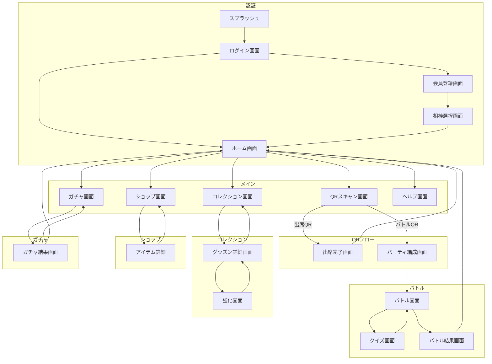

# グッズン - 画面設計書

## 1. 画面遷移図



---

## 2. 画面一覧

| No | 画面ID | 画面名 | 概要 |
|----|--------|--------|------|
| 1 | SPLASH | スプラッシュ | アプリ起動時 |
| 2 | LOGIN | ログイン | 認証 |
| 3 | REGISTER | 会員登録 | 新規登録 |
| 4 | SELECT_PARTNER | 相棒選択 | 初期グッズン選択 |
| 5 | HOME | ホーム | メイン画面 |
| 6 | QR_SCAN | QRスキャン | カメラ読込 |
| 7 | ATTENDANCE | 出席完了 | コイン獲得表示 |
| 8 | PARTY | パーティ編成 | バトル前編成 |
| 9 | BATTLE | バトル | メインバトル |
| 10 | QUIZ | クイズ | 問題回答 |
| 11 | RESULT | バトル結果 | 勝敗・報酬 |
| 12 | COLLECTION | コレクション | グッズン一覧 |
| 13 | DETAIL | グッズン詳細 | ステータス確認 |
| 14 | POWERUP | 強化 | スキルポイント使用 |
| 15 | SHOP | ショップ | アイテム購入 |
| 16 | GACHA | ガチャ | グッズン抽選 |
| 17 | GACHA_RESULT | ガチャ結果 | 獲得演出 |
| 18 | HELP | ヘルプ | 遊び方説明 |

---

## 3. 各画面ワイヤーフレーム

### 3.1 ホーム画面 (HOME)

```
┌─────────────────────────────────┐
│  🪙 1,250        [設定]        │ ← ヘッダー
├─────────────────────────────────┤
│                                 │
│    ┌─────────────────────┐     │
│    │                     │     │
│    │   [相棒グッズン     │     │
│    │    イラスト]        │     │
│    │                     │     │
│    │   エンピツン Lv.15  │     │
│    └─────────────────────┘     │
│                                 │
│    "おはよう！今日も頑張ろう！" │
│                                 │
├─────────────────────────────────┤
│                                 │
│  ┌──────┐  ┌──────┐  ┌──────┐  │
│  │ QR   │  │コレク│  │ショッ│  │
│  │スキャン│  │ション│  │  プ  │  │
│  └──────┘  └──────┘  └──────┘  │
│                                 │
│  ┌──────┐  ┌──────┐  ┌──────┐  │
│  │ガチャ │  │ヘルプ│  │      │  │
│  └──────┘  └──────┘  └──────┘  │
│                                 │
└─────────────────────────────────┘
```

**要素:**
- ヘッダー: コイン残高、設定ボタン
- 相棒表示: グッズン画像、名前、レベル
- セリフ: ランダムメッセージ
- メニュー: 6つの機能ボタン

---

### 3.2 QRスキャン画面 (QR_SCAN)

```
┌─────────────────────────────────┐
│  [←戻る]     QRスキャン        │
├─────────────────────────────────┤
│                                 │
│  ┌─────────────────────────┐   │
│  │                         │   │
│  │                         │   │
│  │     [カメラビュー]      │   │
│  │                         │   │
│  │    ┌───────────┐        │   │
│  │    │           │        │   │
│  │    │  スキャン │        │   │
│  │    │   枠      │        │   │
│  │    │           │        │   │
│  │    └───────────┘        │   │
│  │                         │   │
│  └─────────────────────────┘   │
│                                 │
│   QRコードを枠内に合わせてね！  │
│                                 │
└─────────────────────────────────┘
```

---

### 3.3 バトル画面 (BATTLE)

```
┌─────────────────────────────────┐
│  地形: 炎の教室    ターン: 3    │
├─────────────────────────────────┤
│                                 │
│    ┌─────────────────────┐     │
│    │  [敵グッズン]        │     │
│    │   ワルケシゴム       │     │
│    │   HP ████████░░ 80%  │     │
│    │   🔥炎属性           │     │
│    └─────────────────────┘     │
│                                 │
│  ─────── VS ───────            │
│                                 │
│  ┌───┐ ┌───┐ ┌───┐             │
│  │味1│ │味2│ │味3│  ← 味方    │
│  │80%│ │100│ │60%│             │
│  └───┘ └───┘ └───┘             │
│                                 │
├─────────────────────────────────┤
│  クイズジャンルを選べ！         │
│  ┌──────┐┌──────┐┌──────┐      │
│  │🔥炎  ││💧水  ││🌿草  │      │
│  └──────┘└──────┘└──────┘      │
└─────────────────────────────────┘
```

---

### 3.4 クイズ画面 (QUIZ)

```
┌─────────────────────────────────┐
│  難易度: ★★☆☆☆    残り: 10秒   │
├─────────────────────────────────┤
│                                 │
│  ┌─────────────────────────┐   │
│  │                         │   │
│  │  日本で一番高い山は？   │   │
│  │                         │   │
│  └─────────────────────────┘   │
│                                 │
│  ┌─────────────────────────┐   │
│  │  A. 富士山              │   │
│  └─────────────────────────┘   │
│  ┌─────────────────────────┐   │
│  │  B. 北岳                │   │
│  └─────────────────────────┘   │
│  ┌─────────────────────────┐   │
│  │  C. 槍ヶ岳              │   │
│  └─────────────────────────┘   │
│  ┌─────────────────────────┐   │
│  │  D. 穂高岳              │   │
│  └─────────────────────────┘   │
│                                 │
└─────────────────────────────────┘
```

---

### 3.5 ガチャ画面 (GACHA)

```
┌─────────────────────────────────┐
│  🪙 1,250       ガチャ          │
├─────────────────────────────────┤
│                                 │
│    ┌─────────────────────┐     │
│    │                     │     │
│    │   [ガチャマシン     │     │
│    │    アニメーション]  │     │
│    │                     │     │
│    └─────────────────────┘     │
│                                 │
│  ───────────────────────────   │
│                                 │
│   ノーマルガチャ                │
│   ┌─────────────────────┐      │
│   │  1回  100コイン     │      │
│   └─────────────────────┘      │
│   ┌─────────────────────┐      │
│   │  10回 900コイン     │      │
│   └─────────────────────┘      │
│                                 │
│   [←ホームに戻る]              │
└─────────────────────────────────┘
```

---

### 3.6 コレクション画面 (COLLECTION)

```
┌─────────────────────────────────┐
│  コレクション    12/50体        │
├─────────────────────────────────┤
│                                 │
│  ┌────┐ ┌────┐ ┌────┐ ┌────┐  │
│  │ 🔥 │ │ 💧 │ │ 🌿 │ │ ?? │  │
│  │ エン│ │ケシ│ │メモ│ │    │  │
│  │Lv15│ │Lv8 │ │Lv12│ │    │  │
│  └────┘ └────┘ └────┘ └────┘  │
│                                 │
│  ┌────┐ ┌────┐ ┌────┐ ┌────┐  │
│  │ 🔥 │ │ ?? │ │ ?? │ │ ?? │  │
│  │ハサ│ │    │ │    │ │    │  │
│  │Lv3 │ │    │ │    │ │    │  │
│  └────┘ └────┘ └────┘ └────┘  │
│                                 │
│  [さらに読み込み...]            │
│                                 │
└─────────────────────────────────┘
```

---

### 3.7 グッズン詳細画面 (DETAIL)

```
┌─────────────────────────────────┐
│  [←戻る]    グッズン詳細        │
├─────────────────────────────────┤
│                                 │
│    ┌─────────────────────┐     │
│    │  [グッズン画像]     │     │
│    │                     │     │
│    └─────────────────────┘     │
│                                 │
│   エンピツン    🔥炎属性        │
│   ★☆☆☆☆ (レアリティ1)         │
│                                 │
│  ┌───────────────────────────┐ │
│  │ Lv. 15                    │ │
│  │ HP:    120 ████████████   │ │
│  │ ATK:    45 ██████████░░   │ │
│  │ DEF:    30 ████████░░░░   │ │
│  │ SP:     25 (未使用)       │ │
│  └───────────────────────────┘ │
│                                 │
│  ┌───────────┐ ┌───────────┐   │
│  │   強化    │ │ 相棒設定  │   │
│  └───────────┘ └───────────┘   │
└─────────────────────────────────┘
```

---

### 3.8 ショップ画面 (SHOP)

```
┌─────────────────────────────────┐
│  🪙 1,250       ショップ        │
├─────────────────────────────────┤
│  [強化グッズ] [回復] [その他]   │
├─────────────────────────────────┤
│                                 │
│  ┌─────────────────────────┐   │
│  │ [アイコン]               │   │
│  │ 攻撃力UPグッズ          │   │
│  │ ATK+10  50コイン   [購入]│   │
│  └─────────────────────────┘   │
│                                 │
│  ┌─────────────────────────┐   │
│  │ [アイコン]               │   │
│  │ 守備力UPグッズ          │   │
│  │ DEF+10  50コイン   [購入]│   │
│  └─────────────────────────┘   │
│                                 │
│  ┌─────────────────────────┐   │
│  │ [アイコン]               │   │
│  │ HP回復グッズ            │   │
│  │ HP+30   30コイン   [購入]│   │
│  └─────────────────────────┘   │
│                                 │
└─────────────────────────────────┘
```

---

## 4. 共通UI要素

### 4.1 属性アイコン
| 属性 | アイコン | カラー |
|------|----------|--------|
| 炎 | 🔥 | #FF6B35 |
| 水 | 💧 | #4A90D9 |
| 草 | 🌿 | #7CB342 |

### 4.2 ボタンスタイル
- プライマリ: 角丸、グラデーション背景
- セカンダリ: 枠線のみ
- 無効: グレーアウト

### 4.3 カラーパレット
| 用途 | カラー |
|------|--------|
| 背景 | #1A1A2E |
| カード | #16213E |
| アクセント | #E94560 |
| テキスト | #FFFFFF |
| サブテキスト | #A0A0A0 |
